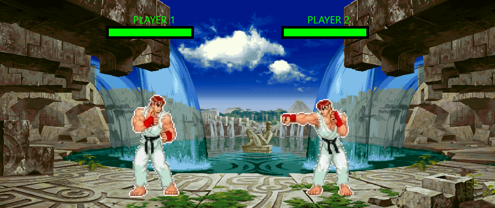

# Ultimate Arena 2D

## Abstract

Wir wollen ein 2D fighting game entwickeln, ähnlich wie zum Beispiel Street Fighter. Man sollte zu zweit lokal gegeneinander spielen können. Beide Spieler werden eine Lebensleiste haben, wer zuerst auf null ist hat verloren. Schaden machen kann man mit einem Schlag, es gibt auch die Option Schläge zu blocken oder ihnen auszuweichen in dem man sich z.B. duckt. Man kann mit dem richtigen Timing auch kritische Treffer landen. 

## Mockups

Für das AdobeXD file [hier](Mockup.xd) klicken.

## Zusätzliche Features

* Unterstützung für Controller
* Über Netzwerk gegeneinander spielen
* Cloud Datenbank um Spieler und Ergebnisse zu speichern
* Leaderboard

## Tastenbelegung

| Funktion | Spieler 1 | Spieler 2 |
| ---------|:---------:| :--------:|
| Links    | a         | j         |
| Rechts   | d         | l         |
| Springen | w         | i         |
| Ducken   | s         | k         |
| Angriff  | e         | o         |
| Blocken  | q         | u         |
| Hadouken | v         | m         |

## Controller

| Funktion | Spieler 1 |
| ---------|:--------------:|
| Links    | Joystick Links |
| Rechts   | Joystick Rechts|
| Springen | y              |
| Ducken   | a              |
| Angriff  | b              |
| Blocken  | rt             |
| Hadouken | x              |

## Technische Implementierung

Die Charaktere wollen wir als Skelleton implementieren, das heist, dass die verschiedenen Körperteile sich bewegen können und alle eine unterschiedliche Hitbox haben. Das wird uns die Kollisionserkennung eines Schlages erleichtern.

## Verwendete Frameworks

* Programmiersprache: Java 15.0.1 
* Desktop UI-Framework: JavaFX 
* Physik Engine: Dyn4j
* Build Tool: Gradle 
* Database: Google Firebase

