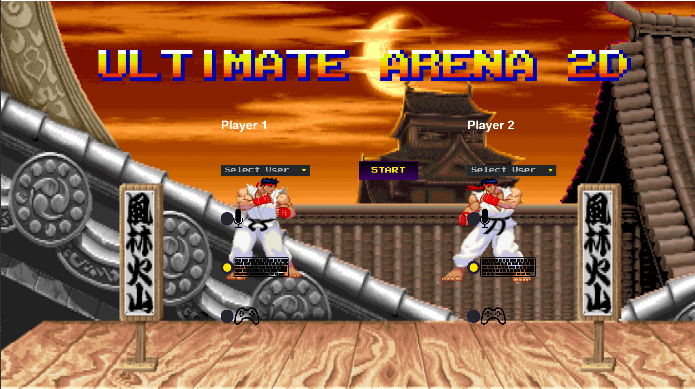
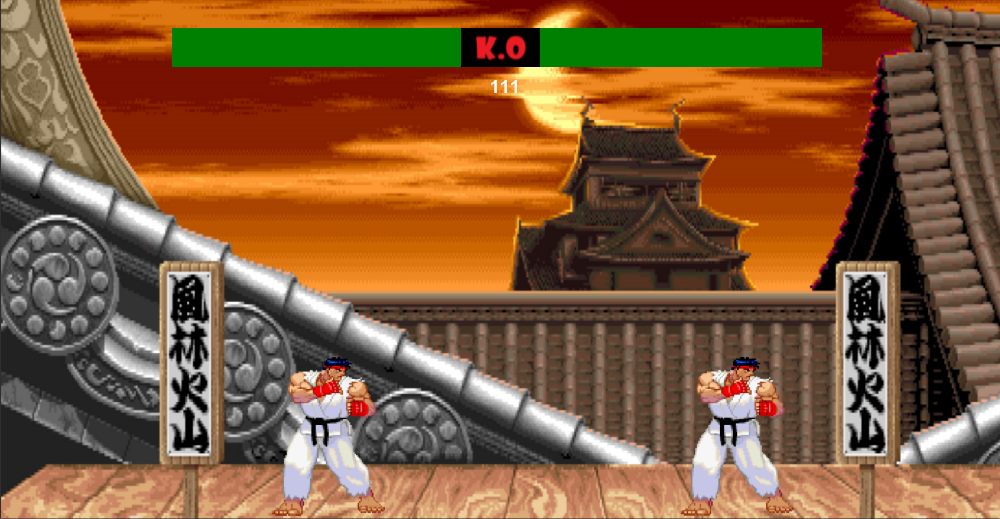
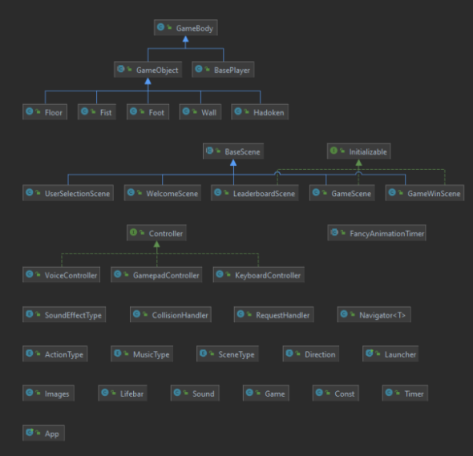

# Ultimate Arena 2D

## Abstract

Wir wollen ein 2D fighting game entwickeln, ähnlich wie Street Fighter. Man sollte zu zweit lokal gegeneinander spielen können. Beide Spieler werden eine Lebensleiste haben, wer zuerst auf null ist hat verloren. Schaden machen kann man mit einem Schlag, es gibt auch die Option Schläge zu blocken oder ihnen auszuweichen in dem man sich z.B. duckt. Das Spieler können mittels der Tastatur bewegt werden. Ein Spieler kann auch mittels Controller gesteuert werden. 

## Mockups

## Zusätzliche Features

* Unterstützung für Controller
* Cloud Datenbank um Spieler und Ergebnisse zu speichern
* Leaderboard im Spiel
* Sprachsteuerung

## Tastenbelegung

| Funktion | Spieler 1 | Spieler 2 |
| ---------|:---------:| :--------:|
| Links    | a         | j         |
| Rechts   | d         | l         |
| Springen | w         | i         |
| Ducken   | s         | k         |
| Angriff  | e         | o         |
| Blocken  | q         | u         |
| Hadoken  | v         | m         |

## Controller

| Funktion | Spieler 1 |
| ---------|:--------------:|
| Links    | Joystick Links |
| Rechts   | Joystick Rechts|
| Springen | y              |
| Ducken   | a              |
| Angriff  | b              |
| Blocken  | rt             |
| Hadoken  | x              |

## Technische Implementierung

Die Charaktere wollen wir als Skelleton implementieren, das heist, dass die verschiedenen Körperteile sich bewegen können und alle eine unterschiedliche Hitbox haben. Das wird uns die Kollisionserkennung eines Schlages erleichtern.

## UML

## Verwendete Frameworks

* Programmiersprache: Java 15.0.1 
* Desktop UI-Framework: JavaFX 
* Physik Engine: Dyn4j
* Build Tool: Gradle 
* Database: Google Firebase
* Controller: Jamepad

